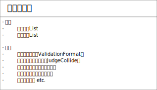
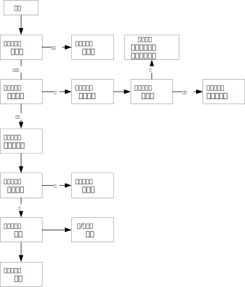

# This is a Problem from Thoughtworks Pair-Programming activity.

**The detail description about the problems si here:

https://www.nowcoder.com/profile/5634911/test/14235039/145749[ https://www.nowcoder.com/profile/5634911/test/14235039/145749 ]**

 ### The Problem is thought using procedure-oriented progamming combined with OOP. The main parts of this code is a ordermanager class.

 ##The following is main class for ordermanager concerning about the problem.

 

##The following is the flowchart of the program.

 

